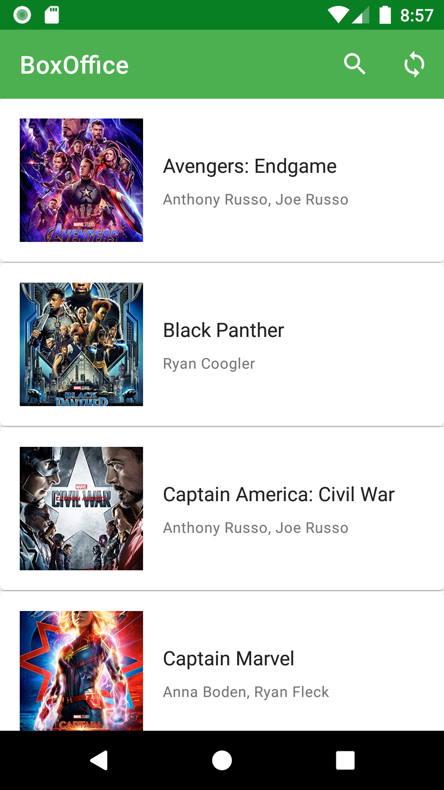
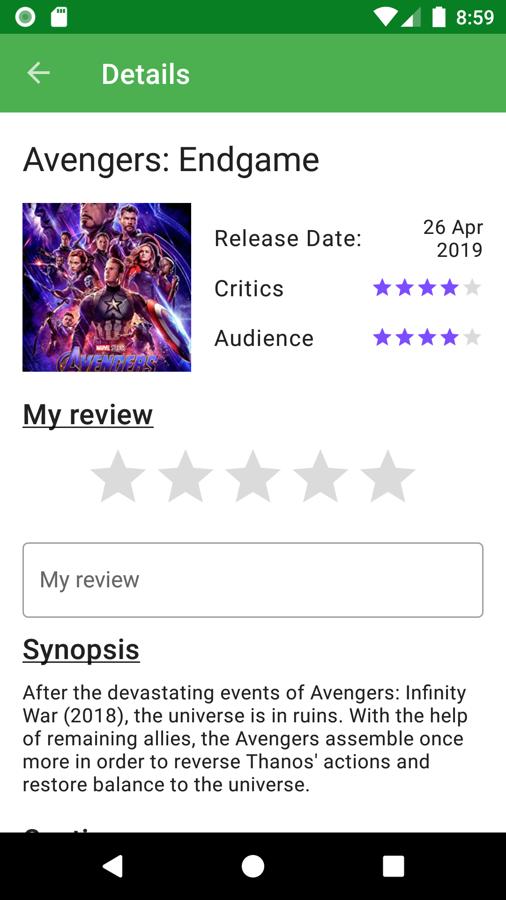

# Box Office

**Goal**: Create an android application allowing to consult the films into the box office.

## Phone display

     

      

## Requirements
* Computer (Windows, Mac or Linux)
* Android Studio

## Setup the project in Android studio
1. Download the project code, preferably using `git clone https://github.com/YannMancel/BoxOffice.git`.
2. In Android Studio, select *File* | *Open...*
3. Select the project
     
     
## Compile and execute the project in Android studio
1. In Android Studio, select *Run* | *Run...*
2. Choose `app` in *Run dialog*
3. Select a device (*Available Virtual Devices* or *Connected Devices*)
4. Select `OK` in *Select Deployment Target dialog*

## API Key
* [OMDb API](http://www.omdbapi.com/apikey.aspx)

## Wiki
* [Android Jetpack](https://developer.android.com/jetpack)
  * [Architecture Components](https://developer.android.com/topic/libraries/architecture/)
    * [LiveData](https://developer.android.com/topic/libraries/architecture/livedata)
    * [ViewModel](https://developer.android.com/topic/libraries/architecture/viewmodel)
    * [Navigation](https://developer.android.com/guide/navigation/)
  * [Foundation Multidex](https://developer.android.com/studio/build/multidex.html)
* [Library Material Components](https://github.com/material-components/material-components-android)
* [Library Moshi](https://github.com/square/moshi)
* [Library Retrofit](https://github.com/square/retrofit)
  * [Converter Moshi](https://github.com/square/retrofit/tree/master/retrofit-converters/moshi)
  * [Adapter RxJava2](https://github.com/square/retrofit/tree/master/retrofit-adapters/rxjava2)
* [Reactive programming](http://reactivex.io/)
  * [Library RxAndroid](https://github.com/ReactiveX/RxAndroid)
  * [Library RxKotlin](https://github.com/ReactiveX/RxKotlin)
* [Library Glide](https://github.com/bumptech/glide)
* [Library Koin](https://github.com/InsertKoinIO/koin)

## Troubleshooting

### No device available during the compilation and execution steps 
* If none of device is present (*Available Virtual Devices* or *Connected Devices*),
    * Either select `Create a new virtual device`
    * or connect and select your phone or tablet
     
     
## Useful
* [Download Android Studio](https://developer.android.com/studio)
* [Create a new virtual device](https://developer.android.com/studio/run/managing-avds.html)
* [Enable developer options and debugging](https://developer.android.com/studio/debug/dev-options.html#enable)